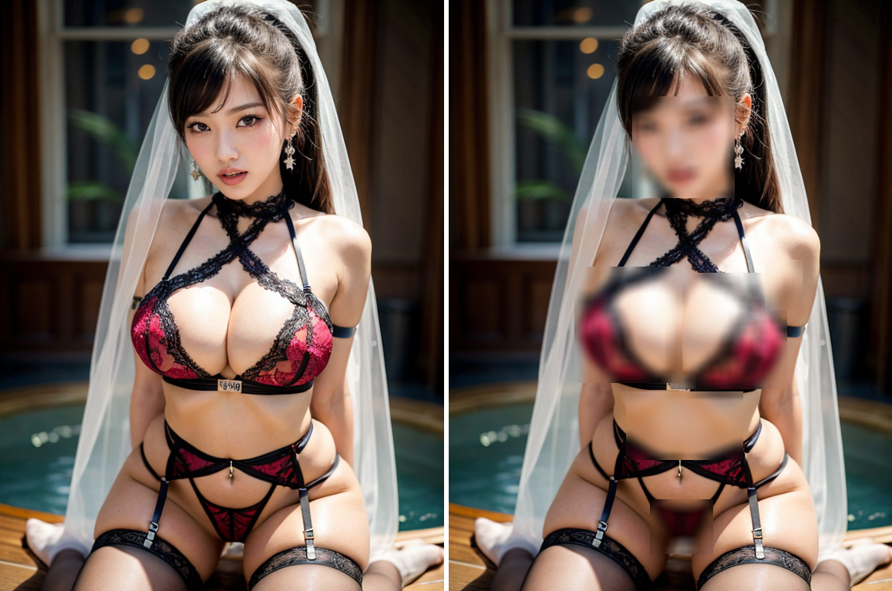

# NSFW detector
This library is meant to detect and censor nsfw content in public media. Models can be found
[here](https://github.com/padmalcom/nsfwdectector/releases/tag/nsfwdetector_v1), they are downloaded automatically and cached.

## Installation
- install requirements.txt
- install pytorch according to your cuda version
- (optional) install onnxruntime-gpu to support cuda usage

## Usage
Instantiate a NsfwDetector class and use the methods detect(), blur(), video() and camera(). The demos show the usage:
- [demo_detect.py](demo_detect.py): Detecting body parts/objects in an image
- [demo_camera.py](demo_camera.py): Live detecting objects in a webcam stream
- [demo_video.py](demo_video.py): Detecting objects in a video and draw bounding boxes and labels to a new video
- [demo_blur.py](demo_blur.py): Detecting objects in an image and blurring them.